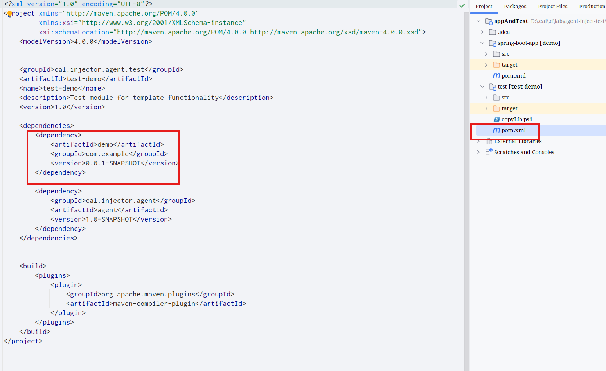
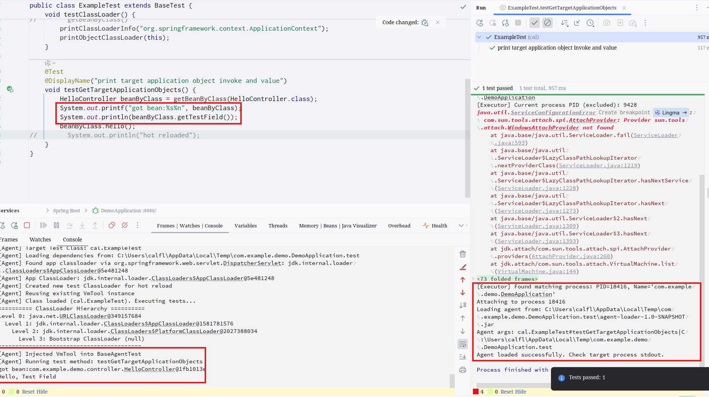
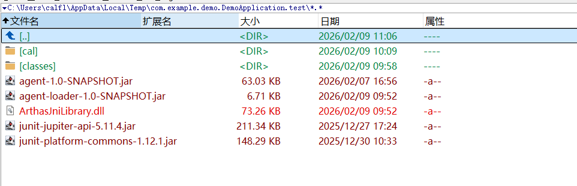

# What is this?

A tool to inject jvm class (And It's dependencies) into target application, and run the jvm class in target application process context. Can do things such as inject test classes into running spring boot application, get running application's beans and invoke bean method as showed in the example

# Different with sping boot test

Spring boot test create a separate test environment, another process. Sometimes you need to create a test environment and encounter dependency or environment issue, such as got the Bean Creation Error, no need for the agent inject test , since it not use its own process, It is injected to the target jvm process and executes in process context. And the test code itself is `hot reload` supported, if you use `JRebel` (Target application will be hot-reloaded also), This could be time-saving.

# Different with Arthas

Principle is same. This can also be done by manual operation:

- compile test class as we do in appAndTest/test project
- redefine classes in arthas
- call test class method using `ognl '@cal.ExampleTest@testGetTargetApplicationObjects()'`

Actually,since a class loader could not get target class loader's class instance as wish, this project use arthas's vmtool to get classes instance in jvm(Delegation seems not reliable as  ).
The difference is

- This simple tool integrate Junit, Which you can run in idea conveniently
- It's small
- There are some wrap method can use, such as `getBeanByClass` in `cal.runner.junit5.BaseAgentTest`, You can write your own in `cal.BaseTest`
- If there are problems in later use , maybe this can be rewritten with arthas lib.

# How to use

- in `inject-agent`, install to maven repository, so `appAndTest/test` can depend on it.
- in `appAndTest/test` add target dependency, And write test
  
- start `appAndTest/spring-boot-app` application
- change the `cal.BaseTest` ,set the target application search pattern(so this tool can find your application)

```java

@RunnerConfig(appName = "com.example.demo.DemoApplication")
public class BaseTest extends BaseAgentTest {
}
```

- Run the test as normal JUnit test method, And the test code is loaded and executed in target process:
  

# Note

- Target application may not have the junit library dependency, so the `Assertions methods` may not work, dependency library can also inject to target jvm process, similear to [copyLib.ps1](appAndTest/test/copyLib.ps1)
  
- The test class and dependency lib all will be copied to `system temp dir`/$searchPattern.test dir, which searchPattern is @RunnerConfig.appName specified in `cal.BaseTest`, all the thing need is in this dir,This dir could be uploaded to remote server, and run inject test for remote process also, You may notice there's no libArthasJniLibrary.so for linux, don't worry, it cound be copied and loaded from agent-1.0-SNAPSHOT.jar automatically at runtime.

```powershell
$classPath = "C:\Users\calfl\AppData\Local\Temp\com.example.demo.DemoApplication.test\"
#rm -v "${classPath}agent-loader-1.0-SNAPSHOT.jar"
#rm -v "${classPath}ArthasJniLibrary.dll"
cd $env:TEMP
rm -v _debug_things.zip
&"C:\Program Files\7-Zip\7z.exe" a -mmt- _debug_things.zip $classPath/
tssh myremote-server --upload-file _debug_things.zip  "~/.local/bin/trz -y /tmp/; cd /tmp/;unzip -o -d _debug_things _debug_things.zip; cd /tmp/_debug_things/; java -cp .:./agent-1.0-SNAPSHOT.jar:/usr/lib/jvm/java-8-openjdk-amd64/lib/tools.jar cal.injector.Executor example.jar irrigate cal.ExampleTest.testGetTargetApplicationObjects"
```

# Know Issues

- Test code may not work , If `spring-boot-devtools` is in use, since `spring-boot-devtools` add a `RestartClassLoader` which is different with Spring Beans's Context ClassLoader, Class in Test Code is delegate to `RestartClassLoader` class definition, vmtool's instance is Spring Beans's Context ClassLoader class definition, which may produce errors like "Can not find bean of class type Exception" or "Class can not cast Exception" , At this circumstance, It can work start up without `spring-boot-devtools`
